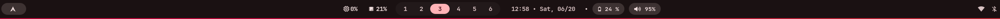
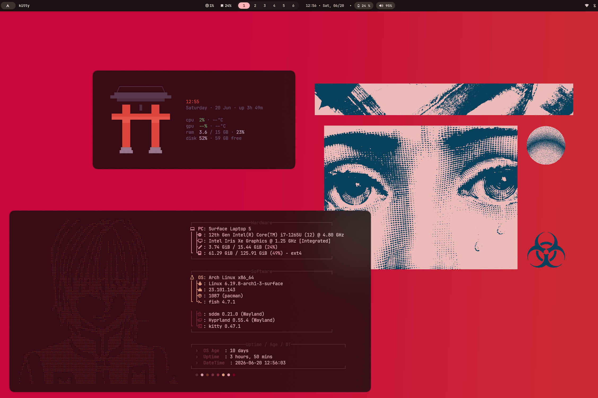
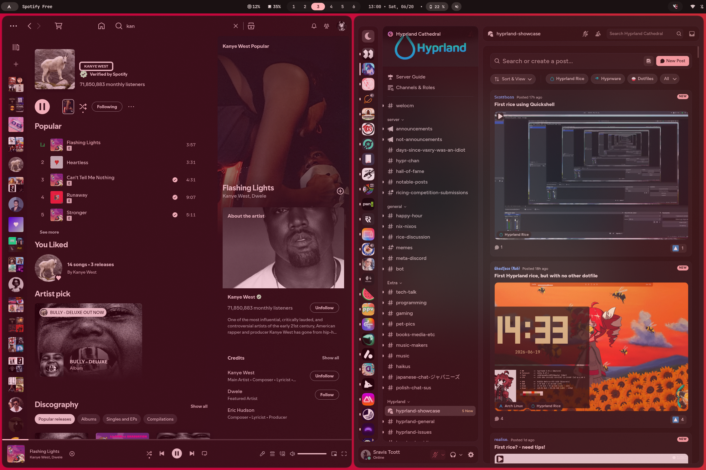
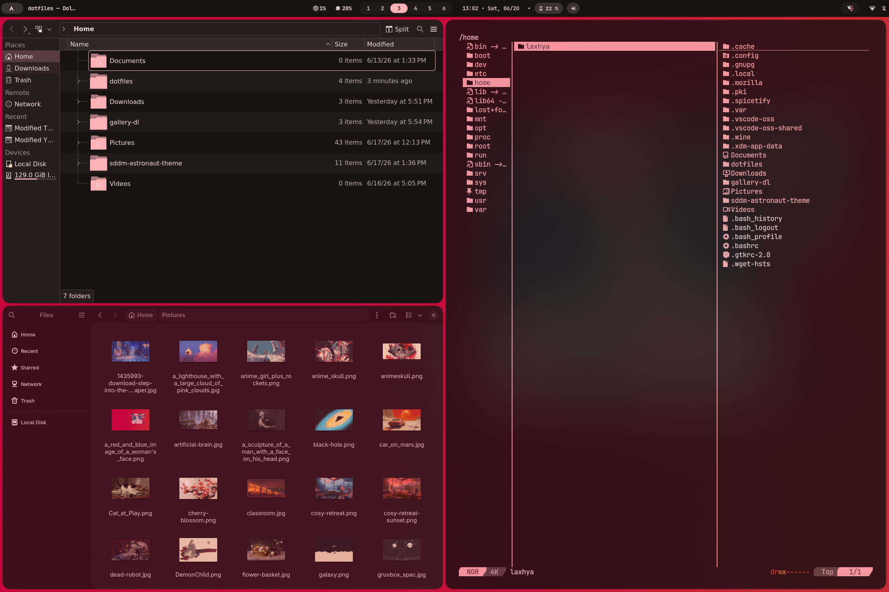

# hyprgen
My custom Hyprland dotfiles with extensive matugen Integration

## Waybar

## Fuzzel

## Wallpaper Switcher

## Kitty Greetings & FastFetch

## Spicetify & Vesktop

## Dolphin | Nautilus | Yazi


# TODO after install

1. To fix xdg-desktop-portals not starting properly, navigate to `/usr/lib/systemd/user/xdg-desktop-portal.service` then comment out these three lines:
    ```
    PartOf=graphical-session.target
    Requisite=graphical-session.target
    After=graphical-session.target
    ```
2. To get programs in conetext menus in dolphine file manager, follow these steps
   ```
   sudo pacman -S archlinux-xdg-menu
   XDG_MENU_PREFIX=arch- kbuildsycoca6
   ```
      then add this to hyprland enviroment variables:
      `hl.env("XDG_MENU_PREFIX", "arch-")`
   
4. To fix OBS-Studio no screen-capture option install wayland portal service
     `sudo pacman -S xdg-desktop-portal-wlr`
